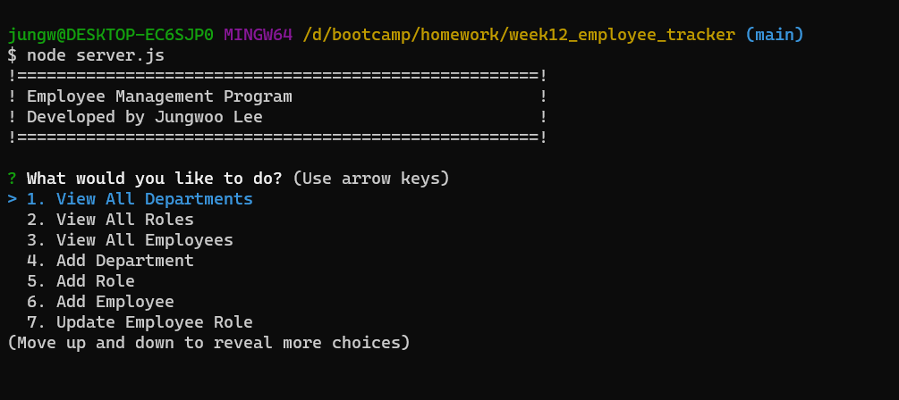

# README by Jungwoo Lee
  

## 1. Title: WEEK12_Employee_Tracker

## 2. Table of Contents:
This readme file includes the following contents:
+ [Description](#3-description)
+ [Installation](#4-installation)
+ [Usage](#5-usage)
+ [License](#6-license)
+ [Application results](#7-application-results)
+ [Questions](#8-questions)

## 3. Description: 
Developers frequently have to create interfaces that allow non-developers to easily view and interact with information stored in databases. These interfaces are called `content management systems (CMS)`. This apllication is a command-line application to manage a company's employee database, using `Node.js`, `Inquirer`, and `MySQL`.

This application provides the following user slection options, then show the results on the user's request:
+ View all departments
+ View all roles
+ View all employee
+ Add a department
+ Add a role
+ Add an employee
+ Update an employee role
+ Quit

## 4. Installation:
Please make sure to have following programs installed on your computer to use this app:
+ VS Code
+ GitBash
+ Node.js
+ MySQL

To use this program, `git clone` the repo down to your local. Then, run `npm install` in order to install the `npm` package dependencies as specified in the `./package.json` - `Express.js`, `mysql2`, and `inquirer` will be installed. Now, you are ready to go!

## 5. Usage:
To use this application, follow the instruction below: 
+ Run `npm install` on your terminal, then it will install the required `npm` packages.
+ Let's create the database - `week12_employee_db`:
  + `mysql -u root -p`: login to `MySQL` then type the following commends:
  + `source /db/schema.sql`
  + `source /db/seeds.sql`
  + `exit`
+ Now, let's run the program:
  + Set an Environmental Variable as:
    + `export MYSQL_PASSWORD=your_password`
    + `echo $MYSQL_PASSWORD` - let's check if the environmental variable is correctly set.
  + Then, run the program:
    + `node server.js`
  + Now, follow the instructions provided from the program.    

This project has the following directory structure:
+ ./Assets
  + week12_employee_tracker.png: this application's main page
  + week12_employee_tracker.avi: this app usage workthrough video
+ ./db
  + schema.sql: this will create a database with empty tables.
  + seeds.sql: this will insert information in tables.
+ ./.gitignore: specifies intentionally untracked files that Git should ginore
+ ./LICENSE: MIT License 
+ ./package.json: specifics of npm's package.json handling
+ ./server.js: main node.js program Javascript file

## 6. License:
### The MIT License
  

## 7. Application results:
[GitHub:] https://github.com/jungwoo33/week12_employee_tracker 
View walk through video here - [Screencastify](https://drive.google.com/file/d/148-KH3bSJJv1v66clEqQU3dNE9kOvg5q/view) 
or the original video file is in `./Assets/week12_employee_tracker.avi` 

## 8. Questions?:
If you have any questions, feel free to contact me via information below:\
[GitHub:] https://github.com/jungwoo33\
[Email:] jungwoo33@gmail.com

- - -
© 2023 Jungwoo Lee. Confidential and Proprietary. All Rights Reserved.